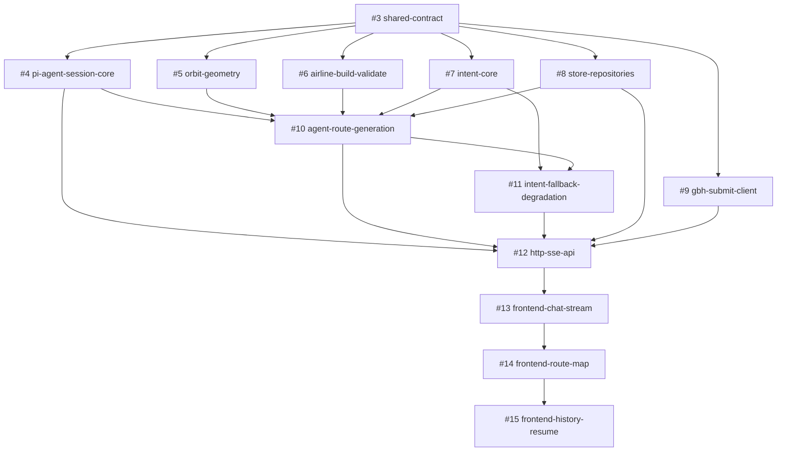

# Task DAG — 基于 DSL 航线编辑脚本的大疆航线编辑 Agent

> 日期：2026-08-21 · 序号：001 · 状态：已发布（Sub Issues #3–#15）
> 节点 = 行为 Task；边 = 真实 blocking edge（前者未完成，后者无法开始）
> Issue 编号：#3 shared-contract · #4 pi-agent-session-core · #5 orbit-geometry · #6 airline-build-validate · #7 intent-core · #8 store-repositories · #9 gbh-submit-client · #10 agent-route-generation · #11 intent-fallback-degradation · #12 http-sse-api · #13 frontend-chat-stream · #14 frontend-route-map · #15 frontend-history-resume

## 拓扑顺序

1. `#3 shared-contract`
2. `#4 pi-agent-session-core`、`#5 orbit-geometry`、`#6 airline-build-validate`、`#7 intent-core`、`#8 store-repositories`、`#9 gbh-submit-client`（可并行，均只依赖 shared-contract）
3. `#10 agent-route-generation`
4. `#11 intent-fallback-degradation`
5. `#12 http-sse-api`
6. `#13 frontend-chat-stream`
7. `#14 frontend-route-map`
8. `#15 frontend-history-resume`

## 检查结论

- 环形依赖：无（所有边单向向下，从 shared-contract 可达全部节点）
- 技术分层拆分：无（每个节点交付可验证的端到端行为，如"多轮澄清闭环""降级闭环""续编回填"）
- 空壳/预留式 Task：无
- 臆测 pre-refactor：无（空仓库从零构建，无存量结构阻碍）
- 真实阻塞：`agent-route-generation` → `store-repositories`（tool 内落库）、`http-sse-api` → `store`/`gbh`/`agent`（端点消费）均为 spec 明确链路
