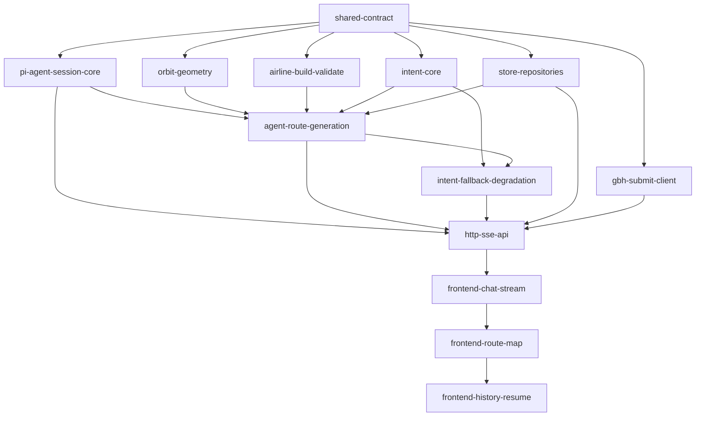

# Task DAG — 基于 DSL 航线编辑脚本的大疆航线编辑 Agent

> 日期：2026-08-21 · 序号：001 · 状态：规划（待调用方发布）
> 节点 = 行为 Task；边 = 真实 blocking edge（前者未完成，后者无法开始）
> 发布后由调用方将节点与依赖更新为真实 Issue 编号。

## 拓扑顺序

1. `shared-contract`
2. `pi-agent-session-core`、`orbit-geometry`、`airline-build-validate`、`intent-core`、`store-repositories`、`gbh-submit-client`（可并行，均只依赖 shared-contract）
3. `agent-route-generation`
4. `intent-fallback-degradation`
5. `http-sse-api`
6. `frontend-chat-stream`
7. `frontend-route-map`
8. `frontend-history-resume`

## 检查结论

- 环形依赖：无（所有边单向向下，从 shared-contract 可达全部节点）
- 技术分层拆分：无（每个节点交付可验证的端到端行为，如"多轮澄清闭环""降级闭环""续编回填"）
- 空壳/预留式 Task：无
- 臆测 pre-refactor：无（空仓库从零构建，无存量结构阻碍）
- 真实阻塞：`agent-route-generation` → `store-repositories`（tool 内落库）、`http-sse-api` → `store`/`gbh`/`agent`（端点消费）均为 spec 明确链路
