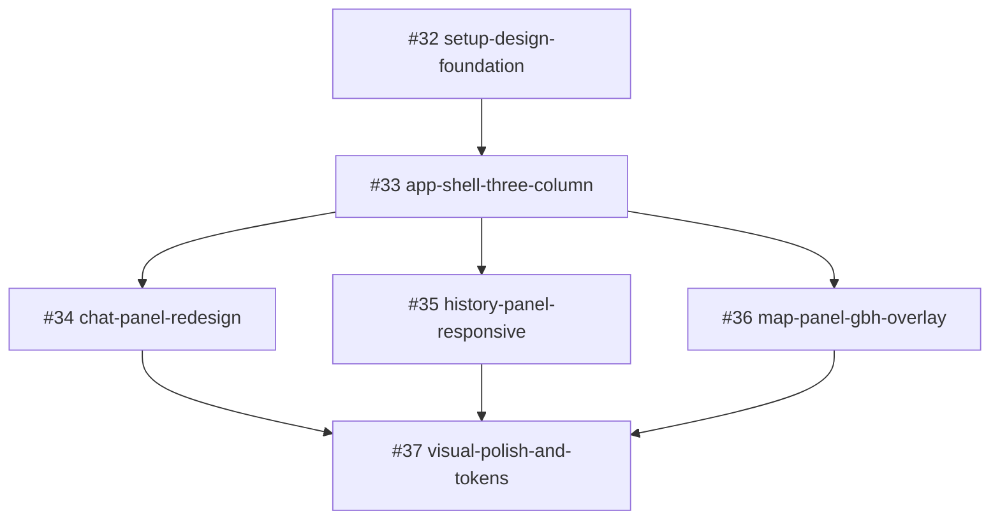

# Task DAG: frontend-ui-redesign

- 日期：2026-08-24
- 关联：`docs/dev/specs/frontend-ui-redesign.md`、ADR-0003、Parent Issue #30
- Planning PR：#31

## 拓扑顺序

1. `setup-design-foundation`（#32，基座：Tailwind v4 + shadcn + token + cn）
2. `app-shell-three-column`（#33，三栏骨架 + 顶栏 + 断点，被 #32 阻塞）
3. 以下三个切片在骨架完成后**可并行**：
   - `chat-panel-redesign`（#34）
   - `history-panel-responsive`（#35）
   - `map-panel-gbh-overlay`（#36）
4. `visual-polish-and-tokens`（#37，收口扫描 + 两断点目检，被以上三个全部阻塞）

## DAG

## 并行说明

- T3/T4/T5 各自修改独立目录（`components/chat`、`components/history`、`components/map`），共享的仅是 T2 产出的 `AppShell`/`layout` 容器与 T1 基座，无相互阻塞，可在独立 worktree 并行。
- T6 是收口切片，必须在三个组件切片合并后执行，负责跨切片视觉一致性与全量扫描门。

## 反模式自检

- 无技术分层式拆分（每个 Task 交付端到端可观察的 UI 行为）。
- 无空壳 Task（T1 完成后应用可启动、测试绿；T2 完成后三栏可点；各组件切片完成后该区可工作）。
- 无虚假依赖（T3/T4/T5 互不依赖；只有真实阻塞关系入边）。
- 无臆测性 pre-refactor（未单列重构 Task；行为保持在迁移内自然完成）。
- 无环形依赖（已核验：线性基座→骨架→三并行→收口）。
