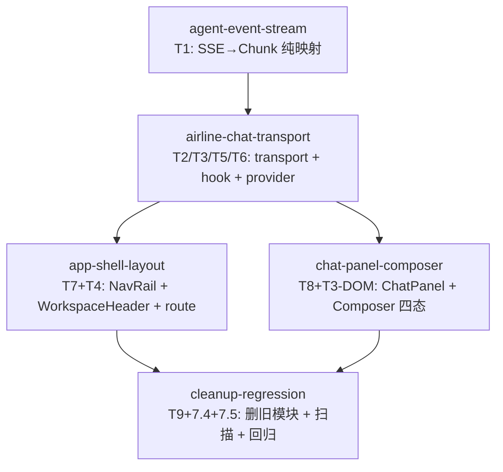

# Task DAG: frontend-layout-ai-composer

- 日期：2026-08-25
- 关联：`docs/dev/specs/frontend-layout-ai-composer.md`、`docs/adr/2026-08-24-frontend-layout-ai-composer.md`、Parent Issue #45

## 拓扑顺序

1. `agent-event-stream`（T1，纯函数流解析 + 单测，无依赖）
2. `airline-chat-transport`（T2/T3/T5/T6，transport + hook + provider，被 T1 阻塞）
3. 以下两个切片在 T2 完成后**可并行**：
   - `app-shell-layout`（T7 + T4，NavRail + WorkspaceHeader + 删旧骨架 + route 接通，被 T2 阻塞）
   - `chat-panel-composer`（T8 + T3 DOM，ChatPanel + Composer 四态 + 空态，被 T2 阻塞）
4. `cleanup-regression`（T9 + PRD 7.4/7.5，删旧模块 + 扫描 + 全量回归，被以上四个全部阻塞）

## DAG

## 并行说明

- T3（app-shell-layout）与 T4（chat-panel-composer）修改独立目录（`components/layout` vs `components/chat`），共享的仅是 T2 产出的 `useAirlineChatContext()` 与 `AirlineChatProvider`，无相互阻塞，可在独立 worktree 并行。
- T5（cleanup-regression）是收口切片，必须在所有行为切片合并后执行，负责删除旧模块、全量扫描与回归门。

## 任务 ↔ 设计/PRD 映射

| Task slug | PRD §7 | Design T 编号 |
|---|---|---|
| `agent-event-stream` | 7.4（useChat 迁移基础） | T1 |
| `airline-chat-transport` | 7.3（停止/错误/降级）、7.4（useChat 迁移） | T2, T3, T5, T6 |
| `app-shell-layout` | 7.1（布局结构）、7.2（断点）、7.3（route 派生 + 状态） | T7, T4 |
| `chat-panel-composer` | 7.2（composer 可见）、7.3（四态 + 空态） | T8, T3-DOM |
| `cleanup-regression` | 7.4（旧模块删除）、7.5（inline-style/颜色） | T9 |

## 反模式自检

- 无技术分层式拆分（每个 Task 交付端到端可观察的行为）。
- 无空壳 Task（T1 完成后流解析可测；T2 完成后全链路可对话；T3 完成后新布局可见；T4 完成后 composer 四态可交互；T5 完成后回归门通过）。
- 无虚假依赖（T3/T4 互不依赖；T5 依赖全部是真实收口阻塞）。
- 无臆测性 pre-refactor（未单列重构 Task；迁移在各行为切片内自然完成）。
- 无环形依赖（已核验：T1→T2→T3/T4→T5，DAG 无环）。
- 测试随行为切片交付，不单独成 Task。
